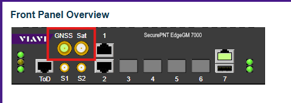
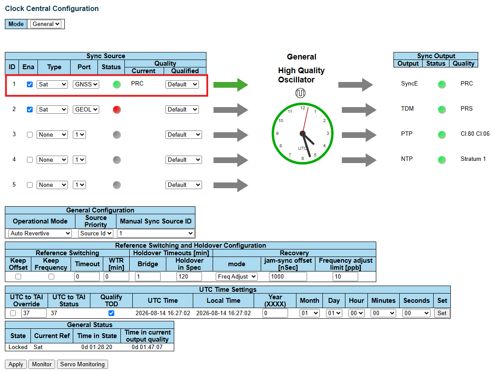
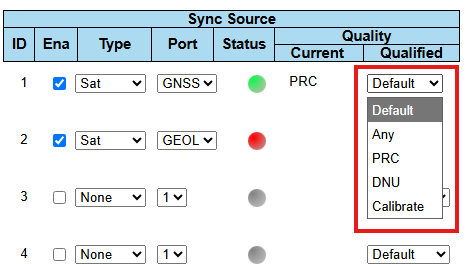
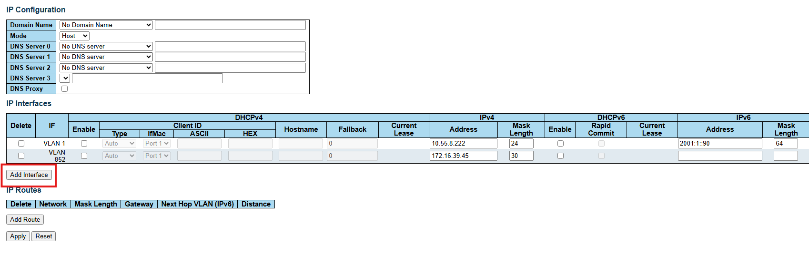
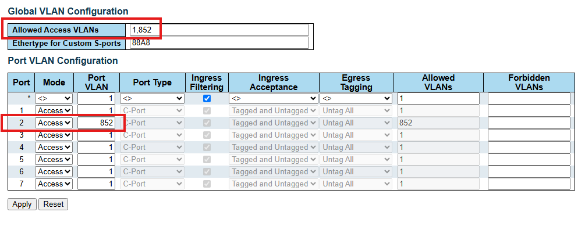
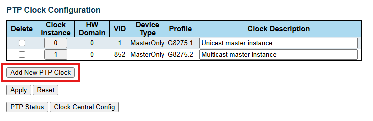
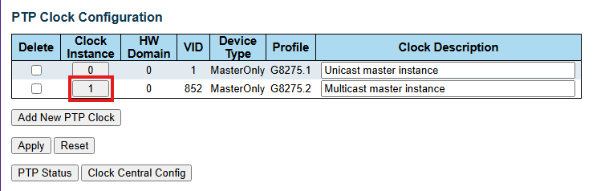

### Web GUI Configuration

---

### PTP

Depois de definir a referência de tempo, o PTP é responsável por distribuir
o relógio de acordo com essa referência.

#### Cenário Proposto - PTP + GNSS/GPS

- GNSS e GEOL fornecem as referências de tempo.
- EGM-7000 é o PTP Grandmaster (GM).
- Os equipamentos downstream são PTP slaves ou outros tipos de clock, dependendo
  da arquitetura.

#### PTP Profile

---

Inicialmente utilizaremos o perfil ITU-T G.8275.1 (Multicast).
Mas também pretendemos realizar os testes utilizando o perfil ITU-T G.8275.2
(Unicast), para que a homologação não seja realizada utilizando apenas um único
perfil.

---

#### PTP Configuration

1. GNSS funcionando:
   - Conectar a antena na entrada correta GNSS. No painel deve aparecer o LED
     correspondente ao GNSS/GPS. O reconhecimento pode demorar.

     

2. Clock source OK:
   - Em Clock Central configurations, habilitar o GNSS e outras fontes de clock
     em Sync source, após isso, deverá aparecer como PRS (Primary reference source) o GNSS.

     

   - Também é possível definir manualmente qual fonte será primária ou secundária
     pelo dropdown ao lado da fonte.

     

3. IP/VLAN OK:
   - Configuration -> System -> IP: Checar/adicionar os IPs das interfaces
     (VLANs) que serão usadas pelo PTP.

     

   - Configuration -> Advanced -> L2 & Switching-> VLANs -> Configuration:
     Adicionar a "Allowed VLANs" a VLAN criada utilizando uma vírgula e definir
     qual porta utilizará a respectiva VLAN.

     

4. PTP Clock habilitado:
   - Em PTP clock configuration, adicionar as instâncias de 0 a 3.
   - Configurar o domínio PTP em HW Domain.
   - Definir qual o profile a ser utilizado para cada instância.

     

5. Configurar portas PTP:
   - Dentro da instância, configurar as portas que serão usadas no PTP.

     

   - Marcar a porta a ser utilizada, habilitar o protocolo que será utilizado
     pelo clock, associar a VLAN em questão e clicar em "Apply".

     

---
